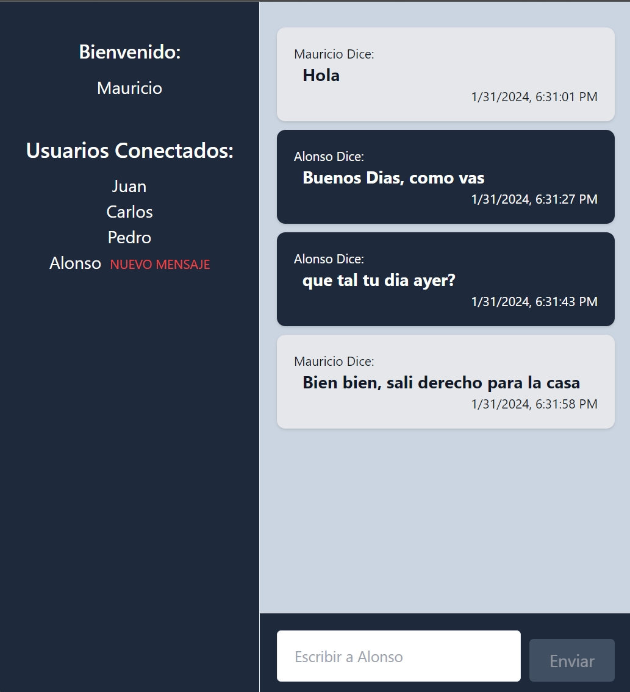

# Chat& WebSockets-SoketIO
# React Corriendo En El Puerto 5173
### https://fogcxy.com/




## Instalar y Correr

```bash
npm install
```


```bash
npm run dev
```

# Build Prod
```bash
npm run build 
```

# Agregar a PM2
- pm2 start npm --name  "chat" --watch -- start
  
## Documentacion  SOLID

#### S - (Principio de Responsabilidad Única): En React, este principio se aplica al diseñar componentes que tienen una única razón para cambiar. Por ejemplo, LoginComponent solo se ocupa del inicio de sesión, mientras que ChatComponent gestiona la visualización y el envío de mensajes.
#### O - (Principio de Abierto/Cerrado): Los componentes en React deben estar abiertos para su extensión pero cerrados para su modificación. Esto se logra a través del uso de props y estados, permitiendo que el comportamiento de un componente pueda ser extendido o modificado sin necesidad de cambiar su código fuente. Por ejemplo, MessageComponent puede mostrar diferentes estilos dependiendo de si el mensaje es del usuario actual o de otro, pero no necesitas modificar el componente en sí para hacerlo.
#### L - (Principio de Sustitución de Liskov): Este principio se aplica menos directamente en React, pero se relaciona con la idea de que los componentes deben ser intercambiables si comparten la misma interfaz. Por ejemplo, si creas diferentes componentes de mensaje (como mensajes de texto, imágenes, etc.), todos deberían poder usarse de manera intercambiable sin romper la aplicación.
#### I - (Principio de Segregación de Interfaces): En React, esto se traduce en crear componentes pequeños y reutilizables que no expongan detalles innecesarios a través de sus props. Cada componente tiene su propia interfaz (props) que está diseñada para satisfacer sus necesidades específicas.
#### D - (Principio de Inversión de Dependencia): Aunque React maneja las dependencias de manera diferente en comparación con los lenguajes de programación tradicionales, este principio puede verse en la forma en que se manejan los datos y las funciones a través de props, permitiendo que los componentes sean más reutilizables y menos acoplados. Esto se ve mas en frameworks como nestjs, donde al aplicar arquitectura hexagonal, se puede ver claramente la inversión de dependencia.

## Arquitectura

### Arquitectura Basada en Componentes:

React sigue una arquitectura basada en componentes, donde la aplicación se construye como un árbol de componentes. Cada componente tiene su propia lógica y estado, y se comunica con otros componentes a través de props.

### Separación de Preocupaciones:

Cada componente en React tiene una responsabilidad específica y está aislado del resto de la aplicación. Esta separación facilita el mantenimiento y el testing.

## Patrones de Diseño

### Estado y Props para Gestión de Datos:

Se utiliza el estado interno (a través de useState) para manejar datos como los mensajes, el alias del usuario, etc. Las props se usan para pasar datos y funciones entre componentes, como en el caso de pasar onLogin a LoginComponent o alias y socket a ChatComponent.

### Componentes Funcionales y Hooks:

Se utilizan componentes funcionales en lugar de clases, y se emplean hooks como useState y useEffect para manejar el estado y el ciclo de vida de los componentes. Esto hace que los componentes sean más ligeros y fáciles de leer.

### Manejo de Efectos Laterales (Side-Effects):

El uso de useEffect para manejar efectos laterales, como la comunicación con el servidor de WebSocket, es un patrón clave en el proyecto. Este hook permite ejecutar efectos que no están directamente relacionados con el renderizado del componente, como establecer y limpiar listeners de eventos.